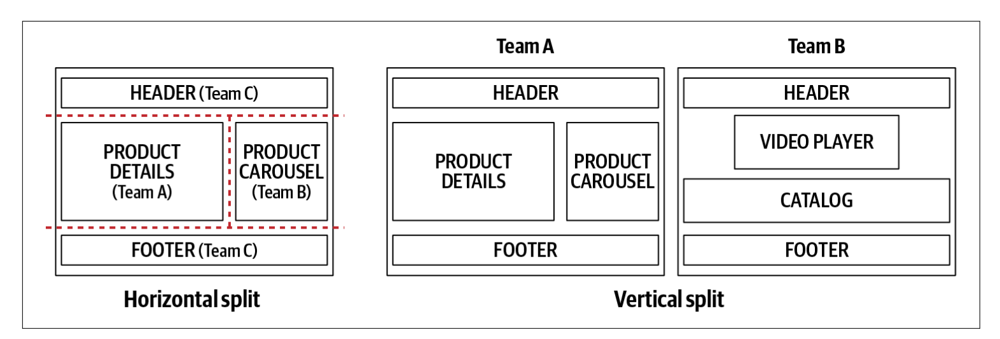
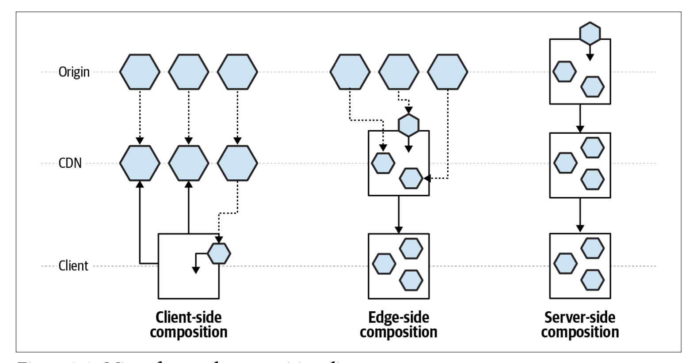
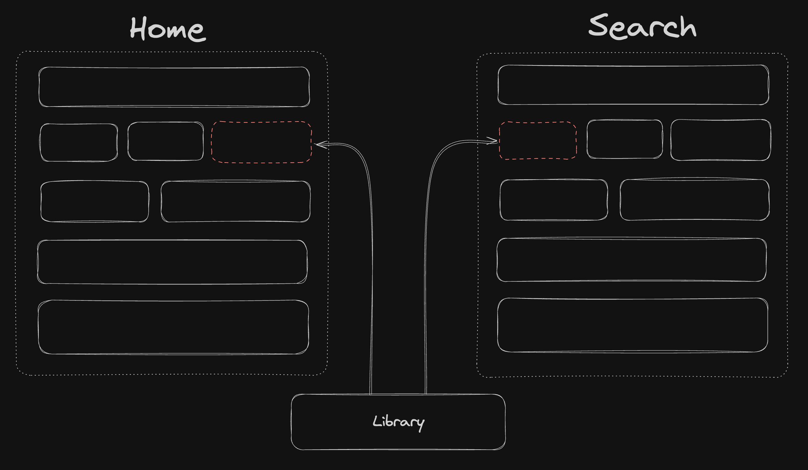
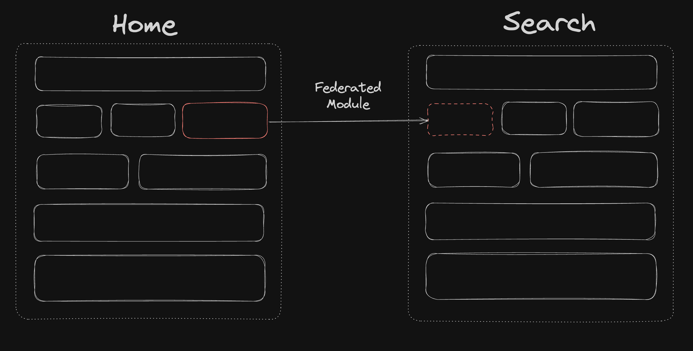
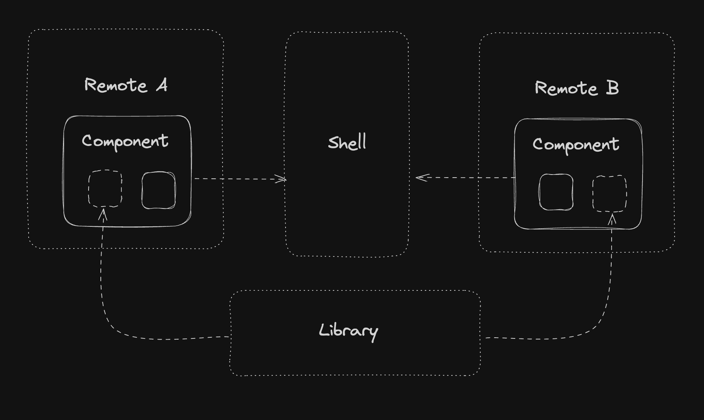

# Micro-Frontend

<h3>with Module Federation</h3>

<div class="opacity-60 mt-4">@Elica</div>

---

# What is Micro-Frontend

- Think about a website or web app as a composition of features
- Each features owned by **independent** teams

---
layout: center
class: text-center
---


<p class="opacity-70">Monolithic Frontends</p>

---
layout: center
class: text-center
---


<p class="opacity-70">Micro-Frontends</p>

---

# The pain of monolithic frontend

<ul>
  <li v-click>Large build/deploy size and time</li>
  <li v-click>Longer time to run unit/integration test cases</li>
  <li v-click>Even if a tiny change needs to be pushed, the entire codebase has to be built, tested, and deployed, which is very time and resource-consuming</li>
  <li v-click>Understanding a large codebase is extremely difficult for designated owners/engineers, especially the new joiners</li>
</ul>

---

# The benefits of Micro-Frontend

<ul>
  <li v-click>Smaller isolated codebases</li>
  <li v-click>Faster and independent deployments. Teams have the flexibility to follow any release cycle(weekly, biweekly, monthly, etc.)</li>
  <li v-click>Lead to smaller impact areas that do not require testing the whole application after deployment</li>
  <li v-click>Hide implementation details, reduce cognitive load</li>
</ul>

---

# Define Micro-Frontend

- Horizontal split
- Vertical split



---

# Micro-Frontends Composition

- Client-side
- Edge-sid
- Server-side



---

# Implementing Client-side Micro-Frontend

<div v-click>
  <h3>Build Time Integration </h3>
  <ul class="ml-4 opacity-70">
    <li>NPM package</li>
    <li>single-spa</li>
  </ul>
</div>

<div v-click class="mt-8">
  <h3>Runtime Integration</h3>
  <ul class="ml-4 opacity-70">
    <li>iframe</li>
    <li>Module Fedration</li>
    <li>Native Federation</li>
  </ul>
</div>

<div v-click class="mt-8">
  <h3>Web component</h3>
</div>

---

# Micro-Frontends Communication

communication between micro-frontends owned by different teams, each micro-frontend should be unaware of the others on the same page

<ul>
  <li v-click>Event-emitter</li>
  <li v-click>Web-storage, Cookie</li>
  <li v-click>URL query string</li>
  <li v-click>Third party state management</li>
</ul>

---

# Micro-Frontend Challenges

<ul>
  <li v-click>Sharing state</li>
  <li v-click>Design System</li>
  <li v-click>SEO</li>
  <li v-click>Performance</li>
  <li v-click>Developer experience</li>
</ul>

---
layout: center
class: text-center
---

# Module Federation


---

# What is Module Federation

Module Federation is a technique that allows developers to share code and resources across multiple applications

- Introduced in Webpack 5.0
- Runtime integration

---

> Traditionally, shared libraries had to be packaged as npm packages.



---

> Module Federation can share libraries at runtime.



---

# Host & Remote



---

# Module Federation 2.0

- Hot reload
- Remote Type Hints
- Not only Webpack, but currently only support by Webpack and Rspack

<div v-click>
  
  <h1 class="rspack">Rspack</h1>
</div>

<style>
.rspack {
  display: inline-block;
  margin: 10px 0 0 38px;
  background: linear-gradient(279deg,#ff8b00 35.21%,#f93920 63.34%);
  -webkit-text-fill-color: transparent;
  background-clip: text;
  font-size: 36px;
  font-weight: 700;
}
</style>

---

# Remote

```js {all|12|13-15}
import { defineConfig } from '@rsbuild/core';
import { pluginReact } from '@rsbuild/plugin-react';
import { pluginModuleFederation } from '@module-federation/rsbuild-plugin';

export default defineConfig({
  plugins: [pluginReact()],
  server: {
    port: 3000,
  },
  plugins: [
    pluginModuleFederation({
      name: 'federation_provider',
      exposes: {
        './button': './src/button.tsx',
      },
      shared: ['react', 'react-dom'],
    }),
  ],
});
```

---

# Host

```js {all|10-13}
import { defineConfig } from '@rsbuild/core';
import { pluginReact } from '@rsbuild/plugin-react';
import { pluginModuleFederation } from '@module-federation/rsbuild-plugin';

export default defineConfig({
  plugins: [
    pluginReact(),
    pluginModuleFederation({
      name: 'federation_consumer',
      remotes: {
        federation_provider:
          'federation_provider@http://localhost:3000/mf-manifest.json',
      },
      shared: ['react', 'react-dom'],
    }),
  ],
  server: {
    port: 2000,
  },
});
```

---

# Import from remote module

```js {all|3}
import './App.css';
// The remote component provided by federation_provider
import ProviderButton from 'federation_provider/button';

const App = () => {
  return (
    <div className="content">
      <h1>Rsbuild with React</h1>
      <p>Start building amazing things with Rsbuild.</p>
      <div>
        <ProviderButton />
      </div>
    </div>
  );
};

export default App;
```

---
layout: center
class: text-center
---

# Demo

<!-- 
npx create-nx-workspace mfe --preset=apps

nx g @nx/react:host apps/shell --remotes=shop,cart
 -->
---

# Referrences

- https://micro-frontends.org/
- https://webpack.js.org/concepts/module-federation/
- https://medium.com/@scriptedalchemy/understanding-webpack-module-federation-a-deep-dive-efe5c55bf366
- https://dev.to/florianrappl/micro-frontends-with-native-federation-56j4
- https://www.oreilly.com/library/view/building-micro-frontends/9781492082989/
- https://rspack.dev/
- https://nx.dev/concepts/module-federation/module-federation-and-nx
